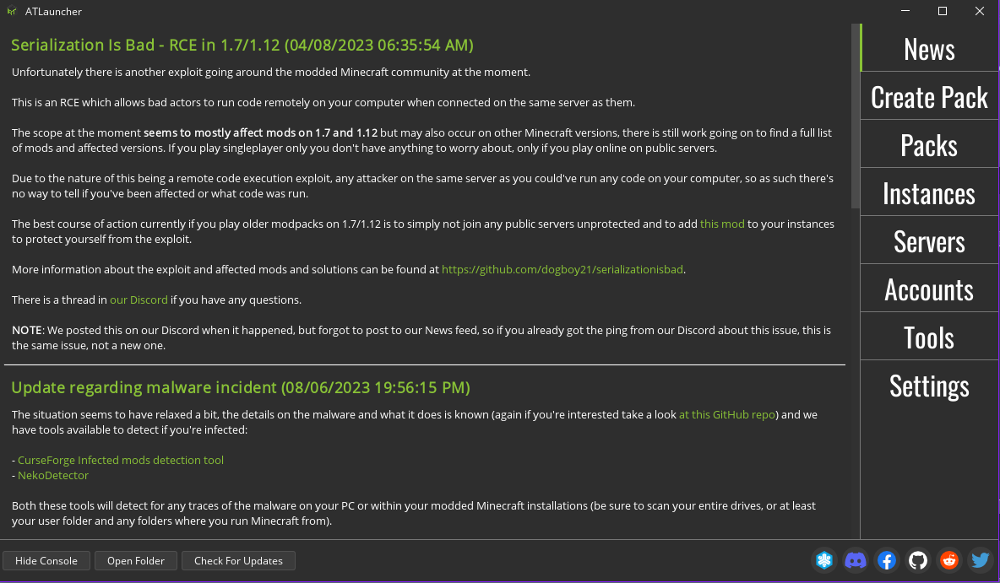
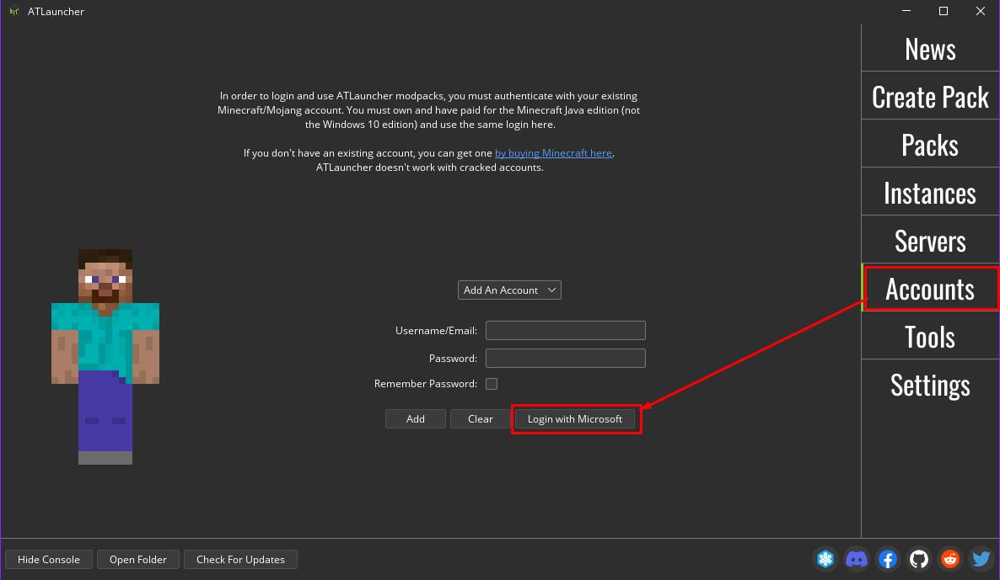
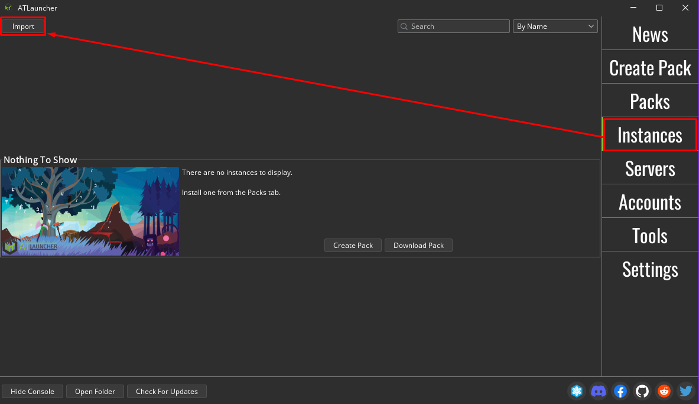
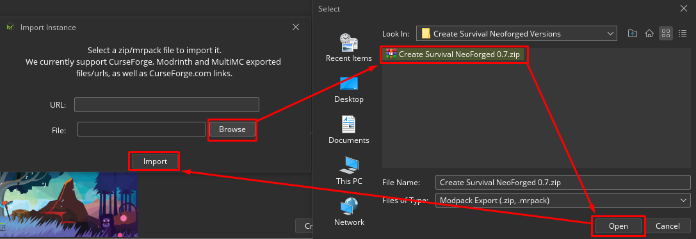
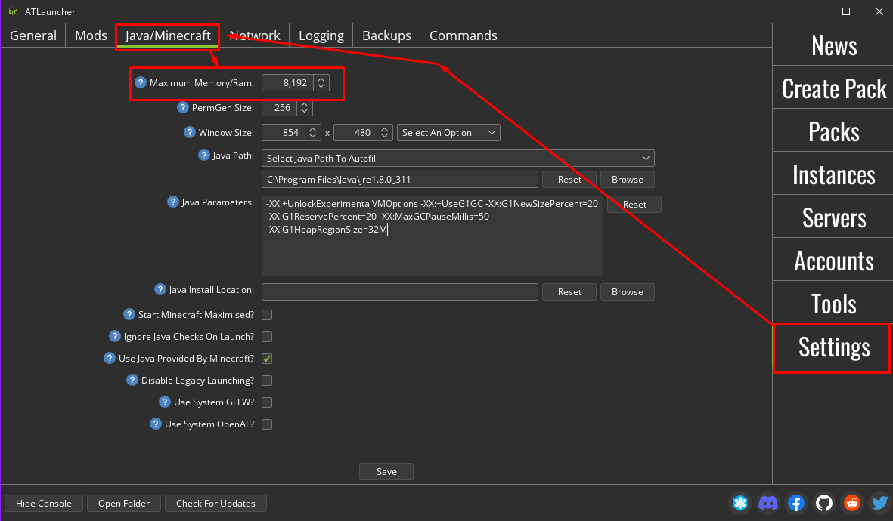

## **<u>REQUIREMENTS</u>**

-   Minecraft: Java Edition (Owned, not cracked)

-   ATLauncher (Recommended but any CurseForge pack compatible launcher will work)

-   Latest Pack Version

NOTE: If you are using any other launcher, you will have to figure it out for yourself, sorry :&gt;

## **<u>Install Steps (ATLauncher)</u>**

1.  Install ATL from <https://atlauncher.com/downloads> **If your using the portable version, make sure its in its own folder.** Go through the setup until you get to the main screen

 
2.  Sign in by going to the "Accounts" tab and click "Login with Microsoft"

 
3.  Once signed in, navigate to the "Instances" tab and click "Import" in the top left of the window

 
4.  After clicking on "Import" locate the pack by clicking on "Browse" and use the popup (Right) to find the pack ZIP (Might be in your downloads folder) Click on "Open" once selected and the click on "Import" on the "Import Instance" window (Left)

 
That's all! Just hit "Play" to launch the pack!

## **<u>Optional but recommended</u>**

Once the pack is done installing, head over to the "Settings" tab and change the category to "Java/Minecraft" and change the "Maximum Memory/Ram" value to 6,144(6GB) or 8,192(8GB)

## **<u>Another optional thing</u>**

If you wish to have my basic settings that include my audio, video, and keybinds, etc. grab the "options.txt" file from the drive folder and put it in the root folder of the pack. (You can get to the packs folder my clicking "Open Folder" on the instance.

## **<u>Updating the pack</u>**

1.  Rename the old version of the pack (Under "Edit Instance") to something you can remember

2.  Grab the latest version of the pack and follow steps 3 and 4.

3.  Once done, click "Open Folder" on the old instance, find "options.txt" and copy it.

4.  After that click "Open Folder" on the new instance and paste it in there.

<u>If you want to save any saves, screenshots, shaderpacks, etc. you can also move the respective folders over as well. The only folders you shouldn't copy over are "mods" and "config".</u>
 

Updating the pack shouldn't have to be this difficult but CurseForge really had to tell me that the modloader and mods aren't compatible.. Kinda what I get for using Neoforge on 1.20.1 I guess...